<h1 align="center">
  
  <br>
  🔮 QueryGPT: Complete Code Walkthrough
  <br>
  <sub>A Hand-Holding Guide Through Every Line of Code</sub>
</h1>

<p align="center">
  <strong>👋 Welcome! This guide will walk you through EVERY piece of code in QueryGPT, explaining what each line does and why it's there.</strong>
</p>

---

## 📚 Table of Contents

1. [**🎯 What is QueryGPT?**](#-what-is-querygpt)
2. [**🗺️ Project Overview**](#️-project-overview)
3. [**📁 Complete File Structure**](#-complete-file-structure)
4. [**🔄 How Everything Works Together**](#-how-everything-works-together)
5. [**📝 Backend Code Walkthrough**](#-backend-code-walkthrough)
   - [api.py - The Main Server](#apipy---the-main-server)
   - [query_gpt.py - The Orchestrator](#query_gptpy---the-orchestrator)
   - [database_inspector.py - Database Operations](#database_inspectorpy---database-operations)
   - [schema_summarizer.py - Making Schemas Readable](#schema_summarizerpy---making-schemas-readable)
   - [claude_refiner.py - AI Integration](#claude_refinerpy---ai-integration)
6. [**🎨 Frontend Code Walkthrough**](#-frontend-code-walkthrough)
   - [App.tsx - React Component](#apptsx---react-component)
   - [App.css - Styling](#appcss---styling)
7. [**🐳 Infrastructure Files**](#-infrastructure-files)
8. [**🚀 Step-by-Step Execution Flow**](#-step-by-step-execution-flow)
9. [**📖 Glossary of Terms**](#-glossary-of-terms)

---

## 🎯 What is QueryGPT?

QueryGPT is a web application that lets users ask questions about a database in plain English, and it automatically converts those questions into SQL queries. Think of it as a translator between human language and database language.

### 🌟 Simple Example:
- **You type**: "How many users are there?"
- **QueryGPT converts to**: `SELECT COUNT(*) FROM users;`
- **You see**: The answer with an explanation

---

## 🗺️ Project Overview

Here's a bird's-eye view of how QueryGPT works:

```mermaid
graph LR
    A[👤 User] -->|Types question| B[🌐 Web Browser]
    B -->|Sends to| C[⚡ Backend Server]
    C -->|Asks AI| D[🤖 Claude AI]
    D -->|Returns SQL| C
    C -->|Runs query| E[💾 Database]
    E -->|Returns data| C
    C -->|Sends results| B
    B -->|Shows answer| A
```

<div align="center">



</div>

---

## 📁 Complete File Structure

Let me explain what each file does:

```
my-claude-project/
│
├── 📁 frontend/                    # Everything the user sees
│   ├── 📁 src/
│   │   ├── App.tsx                # Main React component (the chat interface)
│   │   ├── App.css                # Styling (makes it look pretty)
│   │   └── index.tsx             # Starting point for React
│   ├── Dockerfile                # Instructions to containerize frontend
│   ├── nginx.conf                # Web server configuration
│   └── package.json              # Lists all JavaScript libraries needed
│
├── 🐍 Python Backend Files:
│   ├── api.py                    # Main server that handles requests
│   ├── query_gpt.py              # Coordinates all the different parts
│   ├── database_inspector.py     # Connects to and queries the database
│   ├── schema_summarizer.py      # Makes database structure human-readable
│   └── claude_refiner.py         # Talks to Claude AI
│
├── 🔧 Configuration Files:
│   ├── requirements.txt          # Lists all Python libraries needed
│   ├── .env.example              # Template for environment variables
│   ├── docker-compose.yml        # Orchestrates all containers
│   ├── Dockerfile                # Instructions to containerize backend
│   ├── init.sql                  # Creates database tables
│   └── deploy.sh                 # One-click deployment script
```

---

## 🔄 How Everything Works Together

Before diving into code, let's understand the flow:

<div align="center">


</div>

---

## 📝 Backend Code Walkthrough

Let's go through each backend file line by line:

### api.py - The Main Server

This is the heart of the backend. It receives requests from the frontend and coordinates everything.

```python
#!/usr/bin/env python3

# These are imports - they bring in code from other files/libraries
import os                                    # For reading environment variables
from fastapi import FastAPI, HTTPException   # FastAPI is our web framework
from fastapi.middleware.cors import CORSMiddleware  # Allows frontend to talk to backend
from pydantic import BaseModel              # For data validation
from typing import Optional, List, Dict, Any # Type hints for better code
import uvicorn                              # The server that runs our app
from dotenv import load_dotenv              # Loads .env file

# Load environment variables from .env file
load_dotenv()  # This reads DATABASE_URL, ANTHROPIC_API_KEY, etc.

# Import our custom QueryGPT class
from query_gpt import QueryGPT

# Create the FastAPI application instance
app = FastAPI(title="QueryGPT API", version="1.0.0")
```

**🎯 What's happening here?**
- We're setting up a web server using FastAPI
- Importing necessary tools and our custom code
- Loading secret configuration from a `.env` file

```python
# Add CORS middleware - this is CRITICAL for browser security
app.add_middleware(
    CORSMiddleware,
    allow_origins=["http://localhost:3000"],  # Only allow our React app
    allow_credentials=True,                   # Allow cookies
    allow_methods=["*"],                      # Allow all HTTP methods
    allow_headers=["*"],                      # Allow all headers
)
```

**🔒 CORS Explained:**
- Browsers block requests between different ports by default (security feature)
- Our frontend runs on port 3000, backend on port 8000
- This middleware tells the browser "it's OK, they're friends!"

```python
# Global variable to hold our QueryGPT instance
query_gpt = None

# Define the structure of incoming requests
class QueryRequest(BaseModel):
    question: str  # The user's question as text

# Define the structure of our responses
class QueryResponse(BaseModel):
    sql_query: str                      # The generated SQL
    results: List[Dict[str, Any]]       # Query results as list of dictionaries
    explanation: str                    # Human-readable explanation
    success: bool                       # Did it work?
    error: Optional[str] = None         # Error message if failed
```

**📦 Data Models Explained:**
- `BaseModel` ensures data has the right structure
- Like a contract: "requests must have a question, responses must have these fields"
- `Optional[str]` means the error field can be a string OR None

```python
# This runs when the server starts
@app.on_event("startup")
async def startup_event():
    global query_gpt  # We're modifying the global variable
    
    # Get configuration from environment
    database_url = os.getenv("DATABASE_URL")
    anthropic_api_key = os.getenv("ANTHROPIC_API_KEY")
    
    # Make sure we have what we need
    if not database_url or not anthropic_api_key:
        raise ValueError("Missing required environment variables")
    
    # Create QueryGPT instance with our configuration
    query_gpt = QueryGPT(database_url, anthropic_api_key)
    
    # Pre-analyze the database schema for better performance
    print("🚀 Initializing QueryGPT API...")
    query_gpt.schema_summary = query_gpt.analyze_schema()
    print("✅ QueryGPT API ready!")
```

**🚀 Startup Explained:**
- `@app.on_event("startup")` = "run this when server starts"
- We check for required configuration (API keys, database URL)
- Pre-analyze database schema so we don't do it for every request
- `global` keyword lets us modify the variable defined outside this function

```python
# Basic endpoint to check if API is running
@app.get("/")
async def root():
    return {"message": "QueryGPT API is running"}

# Health check endpoint (used by Docker)
@app.get("/health")
async def health_check():
    return {"status": "healthy", "message": "QueryGPT API is running"}
```

**🏥 Health Checks:**
- `/` = homepage, just says "hello"
- `/health` = used by Docker to check if service is alive
- `async def` = function can handle multiple requests at once

```python
# Main endpoint - processes natural language queries
@app.post("/query", response_model=QueryResponse)
async def process_query(request: QueryRequest):
    try:
        # Check if QueryGPT is initialized
        if not query_gpt:
            raise HTTPException(status_code=503, detail="QueryGPT not initialized")
        
        # Clean up the question
        question = request.question.strip()
        if not question:
            raise HTTPException(status_code=400, detail="Question cannot be empty")
        
        # Check if user typed SQL directly or natural language
        if query_gpt.is_sql_query(question):
            sql_query = question  # They typed SQL, use it directly
        else:
            # Convert natural language to SQL using AI
            sql_query = query_gpt.refiner.convert_natural_language_to_sql(
                question, query_gpt.schema_summary
            )
            
            # Check if AI failed
            if sql_query.startswith("Error"):
                return QueryResponse(
                    sql_query="",
                    results=[],
                    explanation=sql_query,
                    success=False,
                    error=sql_query
                )
        
        # Execute the SQL query and get explanation
        results, explanation = query_gpt.execute_and_explain_query(
            sql_query, query_gpt.schema_summary
        )
        
        # Return successful response
        if results is not None:
            return QueryResponse(
                sql_query=sql_query,
                results=results,
                explanation=explanation,
                success=True
            )
        else:
            # Query failed
            return QueryResponse(
                sql_query=sql_query,
                results=[],
                explanation=explanation,
                success=False,
                error=explanation
            )
    
    except Exception as e:
        # Something went wrong - return error response
        return QueryResponse(
            sql_query="",
            results=[],
            explanation=f"Internal server error: {str(e)}",
            success=False,
            error=str(e)
        )
```

**🎯 Query Processing Explained:**
1. Check if system is ready
2. Clean and validate input
3. Detect if it's SQL or natural language
4. If natural language, ask AI to convert it
5. Run the SQL query
6. Get AI to explain the results
7. Return everything to the frontend

```python
# Endpoint to get database schema information
@app.get("/schema")
async def get_schema():
    try:
        if not query_gpt:
            raise HTTPException(status_code=503, detail="QueryGPT not initialized")
        
        return {
            "schema": query_gpt.schema_summary,
            "success": True
        }
    
    except Exception as e:
        raise HTTPException(status_code=500, detail=str(e))
```

**📊 Schema Endpoint:**
- Returns information about database structure
- Used by frontend to show available tables/columns

```python
# Start the server when this file is run directly
if __name__ == "__main__":
    uvicorn.run(app, host="0.0.0.0", port=8000)
```

**🏃 Running the Server:**
- `if __name__ == "__main__"` = "only run this if file is executed directly"
- `host="0.0.0.0"` = accept connections from any IP address
- `port=8000` = listen on port 8000

---

### query_gpt.py - The Orchestrator

This file coordinates between all the different components:

```python
#!/usr/bin/env python3

import argparse  # For command-line arguments
import os
import sys
from dotenv import load_dotenv

# Load .env file from the same directory as this script
dotenv_path = os.path.join(os.path.dirname(__file__), '.env')
load_dotenv(dotenv_path)

# Import our component classes
from database_inspector import DatabaseInspector
from schema_summarizer import SchemaSummarizer
from claude_refiner import ClaudeRefiner
```

**📦 Imports Explained:**
- We're bringing together all our custom components
- Each handles a specific job (database, formatting, AI)

```python
class QueryGPT:
    """Main orchestrator class that coordinates all components"""
    
    def __init__(self, database_url: str = None, anthropic_api_key: str = None):
        # Validate inputs
        if not database_url:
            raise ValueError("❌ Error: Database connection string is required")
        if not anthropic_api_key:
            raise ValueError("❌ Error: Anthropic API key is required")

        # Initialize each component with its configuration
        self.db_inspector = DatabaseInspector(database_url)      # Handles database
        self.summarizer = SchemaSummarizer()                     # Formats schemas
        self.refiner = ClaudeRefiner(anthropic_api_key)          # Talks to AI
```

**🏗️ Class Structure:**
- `__init__` = constructor, runs when creating a new QueryGPT instance
- We create one instance of each component
- Each component is independent but works together

```python
    def analyze_schema(self, use_claude: bool = True) -> str:
        """Analyze database schema and return human-readable summary"""
        print("🔍 Analyzing database schema...")
        
        # Step 1: Get raw schema from database
        tables = self.db_inspector.get_full_schema()
        
        # Step 2: Convert to human-readable format
        basic_summary = self.summarizer.summarize_schema(tables)
        overview = self.summarizer.generate_schema_overview(tables)
        full_summary = overview + "\n" + basic_summary

        # Step 3: (Optional) Use AI to improve the summary
        if use_claude:
            print("🤖 Refining summary with Claude...")
            refined_summary = self.refiner.refine_schema_summary(full_summary)
            return refined_summary

        return full_summary
```

**🔍 Schema Analysis Flow:**
1. Get technical schema from database
2. Convert to human-readable format
3. Optionally use AI to make it even better
4. Return the final summary

```python
    def suggest_queries(self, schema_summary: str) -> str:
        """Generate example queries based on the schema"""
        print("💡 Generating query suggestions...")
        return self.refiner.generate_query_suggestions(schema_summary)
```

**💡 Query Suggestions:**
- Takes schema summary
- Asks AI to suggest interesting queries
- Helps users get started

```python
    def is_sql_query(self, text: str) -> bool:
        """Check if text looks like SQL or natural language"""
        sql_keywords = ['select', 'insert', 'update', 'delete', 'create', 'drop', 'alter', 'with']
        text_lower = text.lower().strip()
        
        # If it starts with any SQL keyword, it's probably SQL
        return any(text_lower.startswith(keyword) for keyword in sql_keywords)
```

**🔍 SQL Detection:**
- Checks if text starts with SQL keywords
- `any()` returns True if ANY keyword matches
- Used to skip AI conversion for direct SQL

```python
    def execute_and_explain_query(self, query: str, schema_context: str) -> tuple:
        """Execute SQL query and get AI explanation of results"""
        print(f"⚡ Executing query: {query[:50]}...")  # Show first 50 chars
        
        try:
            # Run the query
            results = self.db_inspector.execute_query(query)
            
            # Get AI to explain what the results mean
            explanation = self.refiner.explain_query_results(query, results, schema_context)
            
            return results, explanation
        except Exception as e:
            # Query failed - return error
            return None, f"Error executing query: {e}"
```

**⚡ Query Execution:**
1. Execute SQL against database
2. Get results
3. Ask AI to explain results in plain English
4. Return both results and explanation

```python
    def interactive_mode(self):
        """Command-line interface for QueryGPT"""
        print("🚀 Welcome to QueryGPT Interactive Mode!")
        print("Type 'help' for commands, 'quit' to exit\n")

        # Get initial schema analysis
        schema_summary = self.analyze_schema()
        print("\n" + "=" * 60)
        print("DATABASE SCHEMA ANALYSIS")
        print("=" * 60)
        print(schema_summary)
        
        # Main interaction loop
        while True:
            user_input = input("\nQueryGPT> ").strip()
            
            if user_input.lower() in ['quit', 'exit']:
                print("👋 Goodbye!")
                break
            
            elif user_input.lower() == 'help':
                print("""
Available commands:
- help: Show this message
- schema: Re-analyze database
- quit: Exit the program
- Or type any question/SQL query
""")
            
            # Process as query...
```

**💻 Interactive Mode:**
- Command-line interface for testing
- Shows schema, accepts queries
- Useful for debugging

---

### database_inspector.py - Database Operations

This file handles all database connections and queries:

```python
import psycopg  # PostgreSQL driver
from typing import Dict, List, Tuple
import os
from dataclasses import dataclass

# Data structure to hold table information
@dataclass
class TableInfo:
    name: str                              # Table name
    columns: List[Tuple[str, str]]         # List of (column_name, data_type)
```

**📊 Data Structure:**
- `@dataclass` creates a simple class to hold data
- Each table has a name and list of columns
- Clean way to organize information

```python
class DatabaseInspector:
    """Handles all database operations"""
    
    def __init__(self, connection_string: str = None):
        # Use provided connection string or get from environment
        self.connection_string = connection_string or os.getenv('DATABASE_URL')
        if not self.connection_string:
            raise ValueError("Database connection string is required")
```

**🔗 Connection Setup:**
- Stores database connection details
- Falls back to environment variable if not provided
- Validates we have what we need

```python
    def connect(self):
        """Create and return a database connection"""
        try:
            return psycopg.connect(self.connection_string)
        except psycopg.Error as e:
            raise ConnectionError(f"Failed to connect to database: {e}")
```

**🔌 Database Connection:**
- Creates new connection when needed
- Returns connection object
- Handles connection errors gracefully

```python
    def get_table_names(self) -> List[str]:
        """Fetch all table names from the database"""
        with self.connect() as conn:                          # Auto-closes connection
            with conn.cursor() as cur:                        # Auto-closes cursor
                cur.execute("""
                    SELECT table_name 
                    FROM information_schema.tables 
                    WHERE table_schema = 'public' 
                    AND table_type = 'BASE TABLE'
                    ORDER BY table_name;
                """)
                return [row[0] for row in cur.fetchall()]    # Extract table names
```

**📋 Getting Table Names:**
- `information_schema.tables` = PostgreSQL's table catalog
- `table_schema = 'public'` = only user tables, not system tables
- `with` statements ensure connections are closed properly

```python
    def get_table_schema(self, table_name: str) -> List[Tuple[str, str]]:
        """Get column information for a specific table"""
        with self.connect() as conn:
            with conn.cursor() as cur:
                cur.execute("""
                    SELECT column_name, data_type
                    FROM information_schema.columns
                    WHERE table_name = %s
                    AND table_schema = 'public'
                    ORDER BY ordinal_position;
                """, (table_name,))  # %s is safely replaced with table_name
                return cur.fetchall()
```

**🔍 Column Information:**
- Gets column names and types for a table
- `%s` is a placeholder (prevents SQL injection)
- `ordinal_position` keeps columns in correct order

```python
    def get_full_schema(self) -> List[TableInfo]:
        """Get complete schema information for all tables"""
        table_names = self.get_table_names()
        tables = []
        
        # For each table, get its columns
        for table_name in table_names:
            columns = self.get_table_schema(table_name)
            tables.append(TableInfo(name=table_name, columns=columns))
        
        return tables
```

**📊 Complete Schema:**
1. Get all table names
2. For each table, get its columns
3. Package into TableInfo objects
4. Return complete schema

```python
    def execute_query(self, query: str) -> List[Dict]:
        """Execute any SQL query and return results"""
        with self.connect() as conn:
            with conn.cursor() as cur:
                cur.execute(query)
                
                # Get column names from cursor description
                columns = [desc[0] for desc in cur.description]
                
                # Convert each row to a dictionary
                return [dict(zip(columns, row)) for row in cur.fetchall()]
```

**⚡ Query Execution:**
- Executes any SQL query
- `cur.description` contains column metadata
- `zip(columns, row)` pairs column names with values
- Returns list of dictionaries for easy use

---

### schema_summarizer.py - Making Schemas Readable

This file converts technical database information into human-friendly descriptions:

```python
from typing import List
from database_inspector import TableInfo

class SchemaSummarizer:
    """Converts technical schemas to human-readable format"""
    
    @staticmethod  # No 'self' needed - works like a regular function
    def format_data_type(data_type: str) -> str:
        """Convert PostgreSQL data types to plain English"""
        type_mapping = {
            'integer': 'whole number',
            'bigint': 'large whole number',
            'smallint': 'small whole number',
            'numeric': 'decimal number',
            'real': 'decimal number',
            'double precision': 'decimal number',
            'character varying': 'text',
            'varchar': 'text',
            'text': 'text',
            'char': 'single character',
            'boolean': 'true/false',
            'date': 'date',
            'timestamp': 'date and time',
            'timestamp without time zone': 'date and time',
            'timestamp with time zone': 'date and time with timezone',
            'time': 'time',
            'uuid': 'unique identifier',
            'json': 'JSON data',
            'jsonb': 'JSON data'
        }
        
        # Return friendly name or original if not found
        return type_mapping.get(data_type.lower(), data_type)
```

**🔤 Type Translation:**
- Converts database jargon to plain English
- `integer` → `whole number`
- `.get()` returns default if key not found
- Makes schemas accessible to non-technical users

```python
    @staticmethod
    def summarize_table(table: TableInfo) -> str:
        """Generate a human-friendly summary of a single table"""
        summary = f"**{table.name}** table:\n"
        
        if not table.columns:
            summary += "  - No columns found\n"
            return summary
        
        # List each column with its friendly type
        for column_name, data_type in table.columns:
            readable_type = SchemaSummarizer.format_data_type(data_type)
            summary += f"  - {column_name}: {readable_type}\n"
        
        return summary
```

**📋 Table Summary:**
- Takes a TableInfo object
- Formats as readable text
- Shows each column with friendly type
- Handles empty tables gracefully

```python
    @staticmethod
    def summarize_schema(tables: List[TableInfo]) -> str:
        """Generate summary of entire database schema"""
        if not tables:
            return "No tables found in the database."
        
        summary = f"Database contains {len(tables)} tables:\n\n"
        
        # Summarize each table
        for table in tables:
            summary += SchemaSummarizer.summarize_table(table)
            summary += "\n"
        
        return summary.strip()  # Remove trailing whitespace
```

**📊 Full Schema Summary:**
- Combines all table summaries
- Shows total table count
- Returns complete, formatted schema

```python
    @staticmethod
    def generate_schema_overview(tables: List[TableInfo]) -> str:
        """Generate high-level statistics about the database"""
        if not tables:
            return "Empty database with no tables."
        
        # Calculate statistics
        total_columns = sum(len(table.columns) for table in tables)
        table_names = [table.name for table in tables]
        
        # Format overview
        overview = f"Database Overview:\n"
        overview += f"- Total tables: {len(tables)}\n"
        overview += f"- Total columns: {total_columns}\n"
        overview += f"- Table names: {', '.join(table_names)}\n\n"
        
        return overview
```

**📈 Schema Overview:**
- Provides high-level statistics
- Total tables and columns
- Lists all table names
- Quick database summary

---

### claude_refiner.py - AI Integration

This file handles all communication with Claude AI:

```python
import anthropic  # Anthropic's Claude API library
import os
from typing import Optional

class ClaudeRefiner:
    """Handles all AI-powered operations"""
    
    def __init__(self, api_key: str = None):
        # Get API key from parameter or environment
        self.api_key = api_key or os.getenv('ANTHROPIC_API_KEY')
        if not self.api_key:
            raise ValueError("Anthropic API key is required")
        
        # Create client for API calls
        self.client = anthropic.Anthropic(api_key=self.api_key)
```

**🤖 AI Setup:**
- Stores API key securely
- Creates client for making API calls
- Validates configuration

```python
    def refine_schema_summary(self, schema_summary: str) -> str:
        """Use AI to improve schema descriptions"""
        
        # Craft prompt for Claude
        prompt = f"""
Please refine and improve this database schema summary to make it more clear and user-friendly:

{schema_summary}

Please:
1. Make the language more natural and conversational
2. Identify potential relationships between tables
3. Suggest what kind of application this database might be for
4. Highlight any interesting patterns
5. Keep it concise but informative

Return only the refined summary, no additional commentary.
"""
        
        try:
            # Call Claude API
            response = self.client.messages.create(
                model="claude-3-haiku-20240307",    # Fast, affordable model
                max_tokens=1000,                     # Limit response length
                messages=[{"role": "user", "content": prompt}]
            )
            return response.content[0].text
        except Exception as e:
            # If AI fails, return original with error note
            return f"Error refining summary: {e}\n\nOriginal summary:\n{schema_summary}"
```

**🎯 Schema Refinement:**
- Sends schema to AI with specific instructions
- AI makes it more user-friendly
- Handles errors gracefully
- Returns improved version

```python
    def convert_natural_language_to_sql(self, natural_query: str, schema_context: str) -> str:
        """Convert user's question to SQL query"""
        
        prompt = f"""
Given this database schema context:
{schema_context}

Convert this natural language query to SQL:
"{natural_query}"

Important guidelines:
1. Generate a valid PostgreSQL query
2. Use proper table and column names from the schema
3. For COUNT, SUM, AVG use GROUP BY appropriately
4. When asked for "count by category", use: SELECT category, COUNT(*) FROM table GROUP BY category
5. Include appropriate JOINs if multiple tables needed
6. Use proper WHERE clauses for filtering
7. Order results logically (usually by count/sum descending)
8. Common grouping columns: cloud_provider, environment, cost_center

Return ONLY the SQL query, no explanations or additional text.
"""
        
        try:
            response = self.client.messages.create(
                model="claude-3-haiku-20240307",
                max_tokens=500,
                messages=[{"role": "user", "content": prompt}]
            )
            return response.content[0].text.strip()
        except Exception as e:
            return f"Error converting query: {e}"
```

**🔄 Natural Language to SQL:**
- Takes user's question and schema
- Provides detailed instructions to AI
- Returns pure SQL query
- Handles common patterns (grouping, counting)

```python
    def explain_query_results(self, query: str, results: list, schema_context: str) -> str:
        """Explain query results in plain English"""
        
        # Show only first 5 rows to AI (save tokens)
        results_preview = str(results[:5]) if len(results) > 5 else str(results)
        
        prompt = f"""
Given this database schema context:
{schema_context}

And this SQL query:
{query}

Which returned these results (showing first 5 rows):
{results_preview}

Please provide a clear, human-friendly explanation of:
1. What the query is doing
2. What the results mean
3. Any interesting insights from the data
4. Total number of results: {len(results)}

Keep it conversational and accessible to non-technical users.
"""
        
        try:
            response = self.client.messages.create(
                model="claude-3-haiku-20240307",
                max_tokens=800,
                messages=[{"role": "user", "content": prompt}]
            )
            return response.content[0].text
        except Exception as e:
            return f"Error explaining results: {e}"
```

**💬 Results Explanation:**
- Takes query, results, and schema
- AI explains what happened
- Makes results understandable
- Provides insights about the data

---

## 🎨 Frontend Code Walkthrough

### App.tsx - React Component

This is the main user interface component. Let's go through it section by section:

```typescript
import React, { useState, useRef, useEffect } from 'react';
import axios from 'axios';  // For making HTTP requests
import { Send, Database, Loader2, AlertCircle, CheckCircle2, History, Plus, Copy, Check, ChevronDown, Sparkles, X } from 'lucide-react';  // Icons
import './App.css';  // Styling
```

**📦 Frontend Imports:**
- React hooks for state management
- Axios for API calls
- Lucide icons for UI elements
- CSS for styling

```typescript
// Define data types for TypeScript
interface QueryResult {
  sql_query: string;
  results: Array<Record<string, any>>;  // Array of objects
  explanation: string;
  success: boolean;
  error?: string;  // Optional error message
}

interface Message {
  id: string;
  role: 'user' | 'assistant';  // Who sent it
  content: string;
  result?: QueryResult;  // Optional query result
}
```

**📊 TypeScript Interfaces:**
- Define structure of data
- Helps catch bugs at compile time
- `Record<string, any>` = object with string keys
- `?` means optional field

```typescript
function App() {
  // State variables - React tracks these and re-renders when they change
  const [question, setQuestion] = useState('');           // Current input
  const [loading, setLoading] = useState(false);          // Is query running?
  const [messages, setMessages] = useState<Message[]>([]); // Chat history
  const [history, setHistory] = useState<QueryResult[]>([]); // Query history
  const [showHistory, setShowHistory] = useState(false);   // Show/hide history
  const [copied, setCopied] = useState('');               // Track copied items
  
  // Example queries to help users get started
  const [examples] = useState([
    {
      title: 'Cloud Provider Costs',
      prompt: 'What is the total cost by cloud provider this month?'
    },
    // ... more examples
  ]);
  
  // References to DOM elements
  const textareaRef = useRef<HTMLTextAreaElement>(null);
  const messagesEndRef = useRef<HTMLDivElement>(null);
```

**🎛️ React State Management:**
- `useState` creates reactive variables
- When state changes, component re-renders
- `useRef` creates references to DOM elements
- Arrays in `<>` specify TypeScript types

```typescript
  // Auto-scroll to bottom when new messages arrive
  const scrollToBottom = () => {
    messagesEndRef.current?.scrollIntoView({ behavior: 'smooth' });
  };

  useEffect(() => {
    scrollToBottom();
  }, [messages]);  // Run when messages change
```

**📜 Auto-scrolling:**
- `useEffect` runs side effects
- Scrolls to bottom when messages update
- `?.` is optional chaining (safe access)

```typescript
  const handleSubmit = async (e: React.FormEvent) => {
    e.preventDefault();  // Don't reload page
    
    if (!question.trim() || loading) return;  // Validate input
    
    // Create user message
    const userMessage: Message = {
      id: Date.now().toString(),  // Unique ID
      role: 'user',
      content: question.trim()
    };
    
    // Add to messages and clear input
    setMessages(prev => [...prev, userMessage]);
    setQuestion('');
    setLoading(true);
    
    try {
      // Call backend API
      const response = await axios.post('/api/query', {
        question: userMessage.content
      });
      
      // Create assistant message with results
      const assistantMessage: Message = {
        id: (Date.now() + 1).toString(),
        role: 'assistant',
        content: '',
        result: response.data
      };
      
      // Update UI
      setMessages(prev => [...prev, assistantMessage]);
      setHistory(prev => [response.data, ...prev.slice(0, 19)]);  // Keep last 20
      
    } catch (error) {
      // Handle errors
      console.error('Error:', error);
      // ... error handling
    } finally {
      setLoading(false);  // Always stop loading
    }
  };
```

**🚀 Form Submission:**
1. Prevent default form behavior
2. Validate input
3. Create and display user message
4. Call API
5. Display response
6. Handle errors
7. Update loading state

```typescript
  const copyToClipboard = async (text: string, type: string) => {
    try {
      await navigator.clipboard.writeText(text);
      setCopied(type);  // Track what was copied
      setTimeout(() => setCopied(''), 2000);  // Reset after 2 seconds
    } catch (err) {
      console.error('Failed to copy:', err);
    }
  };
```

**📋 Clipboard Functionality:**
- Uses browser clipboard API
- Shows feedback when copied
- Resets feedback after 2 seconds

```typescript
  // Auto-resize textarea as user types
  useEffect(() => {
    if (textareaRef.current) {
      textareaRef.current.style.height = 'auto';
      textareaRef.current.style.height = `${textareaRef.current.scrollHeight}px`;
    }
  }, [question]);  // Run when question changes
```

**📝 Dynamic Textarea:**
- Adjusts height based on content
- Better UX for multi-line input
- Resets then measures scroll height

```typescript
  return (
    <div className="app">
      <header className="header">
        {/* Header content */}
      </header>
      
      <main className="main">
        <div className="chat-container">
          {messages.length === 0 ? (
            // Show examples when no messages
            <div className="center-prompt">
              {/* Example cards */}
            </div>
          ) : (
            // Show message history
            <div className="messages-container">
              {messages.map((message) => (
                <div key={message.id} className={`message ${message.role}`}>
                  {/* Message content */}
                </div>
              ))}
            </div>
          )}
        </div>
        
        {/* Input form at bottom */}
        <div className="input-section">
          <form onSubmit={handleSubmit}>
            <textarea
              ref={textareaRef}
              value={question}
              onChange={(e) => setQuestion(e.target.value)}
              placeholder="Ask anything"
              disabled={loading}
            />
            <button type="submit" disabled={!question.trim() || loading}>
              {loading ? <Loader2 className="spinner" /> : <Send />}
            </button>
          </form>
        </div>
      </main>
    </div>
  );
```

**🎨 Component Structure:**
- Conditional rendering based on state
- `.map()` renders lists of items
- Event handlers update state
- Disabled states during loading

### App.css - Styling

The CSS uses modern techniques for a professional look:

```css
/* CSS Custom Properties (variables) for consistent theming */
:root {
  --bg-primary: #212121;      /* Main background - dark gray */
  --bg-secondary: #2a2a2a;    /* Slightly lighter for cards */
  --bg-tertiary: #303030;     /* Even lighter for hover */
  --text-primary: #ffffff;    /* Main text - white */
  --text-secondary: #d1d5db;  /* Secondary text - light gray */
  --accent-color: #10a37f;    /* Brand color - green */
  --border-color: #444444;    /* Borders - medium gray */
}
```

**🎨 Design System:**
- CSS variables for consistency
- Easy theme changes
- Dark mode by default
- Professional color scheme

```css
/* Flexbox layout for app structure */
.app {
  min-height: 100vh;          /* Full viewport height */
  background: var(--bg-primary);
  display: flex;
  flex-direction: column;     /* Stack vertically */
}

/* Sticky header */
.header {
  position: sticky;           /* Stays at top when scrolling */
  top: 0;
  z-index: 100;              /* Above other content */
  border-bottom: 1px solid var(--border-color);
}
```

**📐 Layout Patterns:**
- Flexbox for flexible layouts
- Sticky positioning for header
- Z-index for layering
- Minimum heights for consistency

```css
/* Responsive grid for examples */
.examples-container {
  display: grid;
  grid-template-columns: repeat(2, 1fr);  /* 2 equal columns */
  gap: 0.75rem;                           /* Space between */
}

/* Mobile responsiveness */
@media (max-width: 768px) {
  .examples-container {
    grid-template-columns: 1fr;           /* 1 column on mobile */
  }
}
```

**📱 Responsive Design:**
- CSS Grid for layouts
- Media queries for mobile
- Flexible column counts
- Consistent spacing

```css
/* Smooth animations */
.send-button {
  transition: all 0.2s ease;    /* Smooth color changes */
}

.send-button:hover:not(:disabled) {
  background: var(--bg-tertiary);
  color: var(--text-primary);
}

/* Loading spinner animation */
.spinner {
  animation: spin 1s linear infinite;
}

@keyframes spin {
  from { transform: rotate(0deg); }
  to { transform: rotate(360deg); }
}
```

**✨ Animations:**
- Smooth transitions on hover
- Loading spinner rotation
- Disabled state handling
- Professional micro-interactions

---

## 🐳 Infrastructure Files

### docker-compose.yml

This file orchestrates all the containers:

```yaml
version: '3.8'  # Docker Compose file format version

services:
  # Backend API container
  backend:
    build: .                          # Build from Dockerfile in current directory
    container_name: querygpt-backend  # Name for easy reference
    ports:
      - "8000:8000"                   # Map host:container ports
    environment:                      # Pass environment variables
      - DATABASE_URL=${DATABASE_URL}
      - ANTHROPIC_API_KEY=${ANTHROPIC_API_KEY}
    depends_on:                       # Start after database
      - db
    healthcheck:                      # Monitor container health
      test: ["CMD", "curl", "-f", "http://localhost:8000/health"]
      interval: 30s                   # Check every 30 seconds
      timeout: 10s                    # Fail if takes >10s
      retries: 3                      # Try 3 times before marking unhealthy
      
  # Frontend container
  frontend:
    build: ./frontend                 # Build from frontend/Dockerfile
    container_name: querygpt-frontend
    ports:
      - "80:80"                       # Web traffic port
    depends_on:
      - backend                       # Needs backend to be useful
      
  # PostgreSQL database
  db:
    image: postgres:15                # Use official PostgreSQL image
    container_name: querygpt-db
    environment:
      - POSTGRES_DB=${POSTGRES_DB:-querygpt}      # Database name
      - POSTGRES_USER=${POSTGRES_USER:-querygpt}  # Username
      - POSTGRES_PASSWORD=${POSTGRES_PASSWORD:-querygpt}  # Password
    volumes:
      - postgres_data:/var/lib/postgresql/data    # Persist data
      - ./init.sql:/docker-entrypoint-initdb.d/init.sql  # Initialize schema
      
volumes:
  postgres_data:  # Named volume for database persistence
```

**🐳 Docker Compose Explained:**
- Defines multi-container application
- Sets up networking automatically
- Manages dependencies between services
- Handles environment variables
- Ensures data persistence

### Dockerfile (Backend)

```dockerfile
# Start from Python 3.11 slim image (smaller size)
FROM python:3.11-slim

# Set working directory inside container
WORKDIR /app

# Install system dependencies
RUN apt-get update && apt-get install -y \
    build-essential \       # Needed for some Python packages
    && rm -rf /var/lib/apt/lists/*  # Clean up to reduce image size

# Copy and install Python dependencies
COPY requirements.txt .
RUN pip install --no-cache-dir -r requirements.txt

# Copy application code
COPY *.py .

# Expose port 8000
EXPOSE 8000

# Health check command
HEALTHCHECK --interval=30s --timeout=10s --start-period=5s --retries=3 \
  CMD curl -f http://localhost:8000/health || exit 1

# Run the application
CMD ["uvicorn", "api:app", "--host", "0.0.0.0", "--port", "8000"]
```

**📦 Dockerfile Explained:**
- Creates reproducible environment
- Installs dependencies
- Copies code
- Sets up health monitoring
- Defines how to run app

---

## 🚀 Step-by-Step Execution Flow

Let's trace a complete request through the system:

<div align="center">

```mermaid
flowchart TD
    A[User types: "What are total costs by provider?"] --> B[Frontend validates input]
    B --> C[Frontend sends POST to /api/query]
    C --> D[Backend receives request]
    D --> E{Is it SQL?}
    E -->|No| F[Send to Claude AI]
    E -->|Yes| G[Use directly]
    F --> H[Claude returns SQL:<br/>SELECT provider, SUM(cost)...]
    G --> I[Execute SQL on database]
    H --> I
    I --> J[Database returns results]
    J --> K[Send results to Claude for explanation]
    K --> L[Claude explains in plain English]
    L --> M[Backend packages response]
    M --> N[Frontend receives JSON]
    N --> O[Frontend displays results]
    O --> P[User sees answer with explanation]
```

</div>

### Detailed Flow:

1. **User Input** (Frontend)
   - User types question
   - React state updates
   - Form validates input

2. **API Request** (Frontend → Backend)
   - Axios sends POST request
   - Includes question in JSON body
   - Shows loading state

3. **Request Processing** (Backend)
   - FastAPI receives request
   - Validates with Pydantic
   - Extracts question

4. **SQL Generation** (Backend → AI)
   - Detects natural language
   - Sends to Claude with schema
   - Receives SQL query

5. **Query Execution** (Backend → Database)
   - Runs SQL query
   - Gets result rows
   - Handles any errors

6. **Explanation Generation** (Backend → AI)
   - Sends results to Claude
   - Gets human-friendly explanation
   - Combines with results

7. **Response** (Backend → Frontend)
   - Packages everything
   - Sends JSON response
   - Includes success status

8. **Display** (Frontend)
   - Updates message list
   - Shows SQL query
   - Displays results table
   - Shows explanation

---

## 📖 Glossary of Terms

### Programming Concepts:

**API (Application Programming Interface)**
- How different programs talk to each other
- Like a restaurant menu - you order (request) and get food (response)

**Async/Await**
- Way to handle operations that take time
- Like placing an order and doing other things while waiting

**Component**
- Reusable piece of UI
- Like LEGO blocks for building interfaces

**CORS (Cross-Origin Resource Sharing)**
- Security feature in browsers
- Like a bouncer checking IDs at a club

**Docker**
- Tool for packaging applications
- Like a shipping container for software

**Environment Variables**
- Configuration settings
- Like settings on your phone

**FastAPI**
- Python web framework
- Like Express.js but for Python

**Hook (React)**
- Functions that let you use React features
- useState, useEffect, etc.

**Middleware**
- Code that runs between request and response
- Like a filter or checkpoint

**ORM (Object-Relational Mapping)**
- Translates between objects and database
- Not used here - we use raw SQL

**PostgreSQL**
- Relational database system
- Stores data in tables with rows and columns

**Props**
- Data passed to React components
- Like function parameters

**REST API**
- Standard way to structure web APIs
- Uses HTTP methods (GET, POST, etc.)

**State (React)**
- Data that can change in a component
- When state changes, component re-renders

**TypeScript**
- JavaScript with types
- Helps catch bugs before runtime

### Project-Specific Terms:

**Claude AI**
- Anthropic's AI assistant
- Converts natural language to SQL

**Query**
- Request for data from database
- Written in SQL

**Schema**
- Structure of database
- Tables, columns, and types

**Natural Language Processing**
- Understanding human language
- What makes "How many users?" work

---

## 🎉 Congratulations!

You've now been walked through every major piece of QueryGPT! With this knowledge, you can:

- Understand how the system works
- Modify and extend functionality
- Debug issues effectively
- Build similar applications

### 🚀 Next Steps:

1. **Run it locally** - Follow the setup instructions
2. **Make changes** - Try modifying the UI or adding features
3. **Learn by doing** - Best way to understand is to experiment
4. **Ask questions** - If something's unclear, investigate!

Remember: Every expert was once a beginner. Take it one line at a time, and you'll master it! 💪